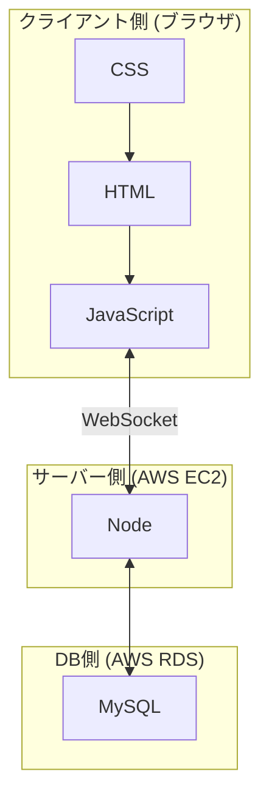

```mermaid
graph TB
    subgraph "クライアント側 (ブラウザ)"
        A[HTML] --> B[JavaScript]
        C[CSS] --> A
    end
    subgraph "サーバー側 (AWS EC2)"
        D[Node]
    end
    subgraph "DB側 (AWS RDS)"
        E[MySQL]
    end
    B <--> |WebSocket| D
    D <--> E
```
